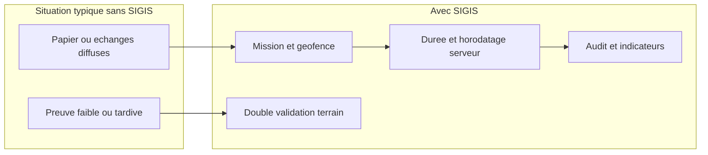
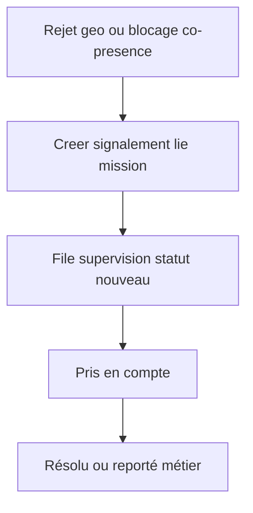
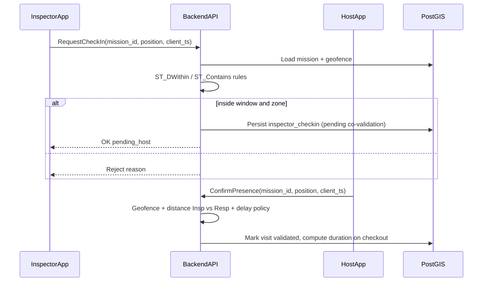

# MINESEC, MINSUB — Réflexion SIGIS : modélisation métier et backend (angle « panel expert »)

## Situation au Cameroun — lecture réaliste

**Gouvernance et acteurs** : MINESEC, MINSUB et organismes déconcentrés (académies, délégations départementales) organisent des chaînes où l’**inspection** joue à la fois un rôle de **contrôle** et d’**accompagnement**. Les inspecteurs couvrent souvent de **larges zones** avec des moyens de déplacement et une connectivité **variables**.

**Périmètre institutionnel du pilote (à trancher avant cadrage détaillé)** : le premier déploiement doit être **explicite** — **MINESEC** (enseignement de base), **MINSUB** (secondaire), ou **deux pilotes distincts** avec référentiels et interlocuteurs **séparés**. **Ne pas** mélanger les chaînes dans un même pilote **sans** décision écrite (acteurs, vocabulaire, périmètres géographiques d’autorité).

**Pratiques habituelles** : la traçabilité repose encore fortement sur **rapports**, **convocations**, **feuilles de présence** et signatures, avec des **délais** entre le terrain et la centralisation. Les **preuves objectives** de présence (qui, où, combien de temps) sont souvent **dispersées**, **non comparables** entre services, ou **reconstruites a posteriori**.

**Contraintes matérielles** : réseau **irrégulier** (2G/3G, coupures), téléphones **hétérogènes** (Android majoritaire), établissements en milieu **rural** avec coordonnées parfois **imprécises** sur les fonds cartographiques. Les **responsables d’établissement** n’ont pas tous la même aisance numérique.

**Risques sociopolitiques** : un outil perçu uniquement comme « surveillance punitive » peut être **contesté**. Un positionnement **transparence et réciprocité** (l’établissement **co-valide** explicitement) et la **reconnaissance du travail** bien fait améliorent l’adhésion.

**Enjeu central (double)** : (1) passer d’un **récit administratif** à une **preuve structurée** de **présence** (qui, où, combien de temps) ; (2) éviter que le produit soit réduit à un **« pointage »** — donc ajouter une couche **légère** de **mission utile** (type de mission, mini-checklist, trace contextuelle) pour répondre au métier réel : **pas seulement « il était là »**, mais **« une inspection exploitable a été engagée »** (sans mesurer toute la qualité pédagogique, ce qui reste humain et documentaire).

---

## Positionnement de SIGIS

**SIGIS** se positionne comme **système d’information de traçabilité** des missions d’inspection : il **complète** les textes et rapports existants par une **couche vérifiable** (géofence + double validation + durée) et une **couche métier minimale** (type de mission / checklist courte / note ou preuve contextuelle optionnelle) pour limiter la critique « outil de pointage ».

**Promesse métier — présence** : séquence d’événements cohérente — inspecteur et responsable dans le **périmètre** (ou règle d’**incertitude** tracée), dans la **fenêtre** de mission, avec **entrée/sortie** tracées.

**Promesse métier — utilité (V2, pas V1)** : à la clôture, l’inspecteur **atteste** via `MissionOutcome` (alias `VisitReportLite`) : type de mission, checklist courte, note / preuve légère. **V1 pilote** se concentre sur **présence vérifiable** ; la couche « pas seulement du pointage » arrive **après** stabilisation terrain.

**Périmètre de responsabilité honnête** : SIGIS ne **remplace pas** l’appréciation pédagogique ni le dialogue avec l’établissement ; il ne **résout pas seul** les conflits humains. La **valeur juridique** des enregistrements doit être **alignée** avec les procédures RH et disciplinaires en vigueur (SIGIS = **élément de preuve technique** dans un dossier plus large).

**Principe produit explicite** : **SIGIS n’est pas un outil disciplinaire automatique** — pas de sanction dérivée **uniquement** d’un indicateur (taux d’échec géo, « anomalie »). Les signaux **déclenchent une investigation humaine** dans le cadre des procédures existantes.

### Synthèse d’alignement (regard **multi-experts** terrain / institutionnel / produit)

Les **forces** du cadrage actuel — rares dans les spec admin publique **francophone africaine** — sont : priorité **sociotechnique** (Goodhart, double système, peur, décoratif), **co-présence** comme invariant **métier**, **limites assumées** publiquement, **phasing** V1/V2/V3, **mini-workflow** signalement sans trou noir, **DDD** esquissé sans techno-centrisme. Le positionnement **preuve technique de présence cohérente ≠ jugement de qualité** + **charte** est exactement ce qui permet à un tel SI de **survivre** au terrain.

Les **risques résiduels** à traiter **avant** la première ligne de code ne sont plus surtout conceptuels : **réduction du périmètre pilote**, **référentiel géo budgété**, **fallback** pour responsables **sans** smartphone pleinement opérationnel, **rôle « responsable d’accueil »** figé dans le **glossaire**, **UX offline** non négociable, **KPI hiérarchie** **légers**, **charte** validée au **plus haut niveau** institutionnel possible pour résister à la **pression** « classements / ménage ». La tentation **« une petite feature de plus »** reste la **première** cause d’échec **après** un bon design.

---

## Roadmap en trois vagues (éviter la mort par complexité)

Le document complet décrit une **cible** ; un **MVP unique** qui tout embarquerait **ralentit** le dev, **retarde** un pilote terrain ou **sature** les utilisateurs. Découpage recommandé :

### V1 — Pilote terrain (livrer en priorité)

**Périmètre pilote (discipline « moins mais mieux »)** : **une** académie **ou** **une** délégation départementale **maximum** ; **30 à 50 établissements** couverts **au plus** ; **ambassadeurs terrain nommés** par zone. Élargir **après** preuve — sinon la complexité organisationnelle tue le pilote avant la techno.

**Inclus** : `Mission` ; **check-in / check-out** ; **double validation** inspecteur + responsable selon **un mode de validation hôte** parmi ceux définis (voir **§ Modes de validation hôte et invariants V1**) ; **géofence simple** (voir section géo V1) ; **preuve de co-présence** conforme au **mode** (distance + délai **lorsque** deux positions GPS sont disponibles ; règles **équivalentes** documentées pour QR / SMS — **sans** exiger deux GPS si le mode ne le permet pas) ; **barrière anti-validation « à distance »** dans les limites du mode ; **offline minimal** + **UX de sync** lisible (voir exigences §5) ; horodatage serveur ; rôles de base.

**Réalité terrain Cameroun** : exiger **deux smartphones** avec **app installée** + **GPS** pour **tous** les directeurs peut **bloquer** le pilote (Android bas de gamme partagé, **feature phone**). **Prévoir dès V1** au moins un **fallback ultra-léger** pour le **responsable d’accueil** (à trancher en conception, mais à **budgeter** et **spécifier** avant code) : par exemple **QR code statique** (affiche imprimée à l’établissement ou montrée par l’inspecteur) **scannable** avec **n’importe quel téléphone** ; et/ou **validation par SMS** ou **USSD** via **numéro court** (sous réserve opérateurs / coût / délai). **Objectif** : jamais « le directeur n’a pas l’app » comme **point de rupture** unique.

**Exclu volontairement** : `MissionOutcome` (utilité métier) ; **ExceptionWorkflow** complet ; anti-replay **complexe** ; audit **WORM / hash chain** ; analytics poussés ; `DeviceContext` **riche** (minimum traçable si coût faible : version app, etc.).

**Objectif** : **prouver l’adoption** et la **faisabilité terrain**, pas la perfection.

**Risque humain (angle mort classique)** : le système peut être **correct en base** et **faux en réalité** (inspecteur appelle le responsable : « valide », celui-ci valide depuis **son bureau**). Le **mode « deux apps + deux GPS »** permet la **distance inter-appareils** comme invariant fort ; les **modes fallback** (QR, SMS/USSD) imposent d’autres **invariants** (ancrage token, fenêtre temporelle, corrélation mission ↔ établissement) — **pas** la même fonction mathématique, mais **même intention** : réduire la validation **sans présence locale**. **Spécifier** chaque mode **avant** le code (voir section dédiée).

**Danger à la livraison** : **céder** à « **juste une petite feature** » avant le pilote terrain — la principale menace **après** la conception.

### V2 — Ancrage métier et gouvernance

**Inclus** : `MissionOutcome` (ou `VisitReportLite`) — type de mission, checklist courte, note / preuve légère ; **ExceptionWorkflow** (backend + validation hiérarchique) ; **visibilité avancée** (agrégats par niveau, exports encadrés) ; **DeviceContext** plus complet ; règles géo **raffinées** ; **QR / codes** **enrichis** ou **dynamiques** si le V1 n’a eu que QR **statique** / SMS ; anti-replay **renforcé** ; **dashboard d’anomalies « soft »** (signaux répétés, patterns — **indicateurs pour enquête humaine**, **pas** sanction automatique) ; **rapport** ou file des **anomalies répétitives** pour prioriser les investigations.

### V3 — Résilience « institution » et audit lourd

**Inclus** : anti-fraude avancée (patterns, corrélations) ; **append-only / hash chain** ; exports vers stockage **WORM** ; **snapshots signés** ; analytics et tableaux de bord **contrôlés**.

**Principe directeur** : **cohérence métier + simplicité d’usage + adoption** avant **sécurité avancée** — le risque principal au départ est le **contournement humain** (WhatsApp, papier), pas l’attaque cryptographique sophistiquée.

---

## Limites structurelles (rarement dans les specs, souvent causes d’échec)

SIGIS peut échouer **moins** par la mauvaise techno que par le **terrain**, le **politique** et le **comportement**. Limites à assumer publiquement (charte / cadrage) :


| Zone                           | Limite honnête                                                                                                                                                                                                             |
| ------------------------------ | -------------------------------------------------------------------------------------------------------------------------------------------------------------------------------------------------------------------------- |
| **Contournement humain**       | Même avec co-présence GPS : **rendez-vous rapide** sur place pour valider puis départ, **téléphone prêté**, **spoofing** (minoritaire mais possible). Le système ne lit **pas l’intention** ni la **qualité pédagogique**. |
| **Acceptabilité politique**    | Si SIGIS = « surveillance / sanction » → **résistance passive**, retour papier, sabotage d’usage. La **donnée** peut être **instrumentalisée** — d’où charte, agrégats par défaut, pas de classement public automatique.   |
| **Fracture numérique**         | Téléphones **bas de gamme**, GPS **instable** (dérives 200–500 m), **batterie**, **offline long** → trop de contraintes = **abandon silencieux**.                                                                          |
| **Référentiel géo**            | Coordonnées **fausses** → rejets **injustes** → phrase tueuse : « je suis là, **votre** carte est fausse ». Un mauvais référentiel **tue la confiance** dans tout le reste.                                                |
| **Effet Goodhart**             | Si les décideurs transforment visites / durées en **performance individuelle** chiffrée, les acteurs **optimisent le score** (visites courtes, etc.), pas la qualité.                                                      |
| **Preuve technique vs vérité** | SIGIS prouve une **cohérence de signaux** (présence minimale), pas une **mission riche** ni une vérité absolue — **5 minutes sur site** peuvent être « techniquement validées » mais **métier vide**.                      |
| **Surcharge UX**               | Au-delà de **~3 clics** pour l’action principale → contournement.                                                                                                                                                          |
| **Exceptions**                 | Sans **sortie simple** (rejet géo, absent, école fermée) → **30–40 %** des cas partent sur **WhatsApp / appel / papier**.                                                                                                  |
| **Double système**             | SIGIS « pour la forme », vraie vie dans **cahiers et réseaux informels** — le SI devient **décoratif**.                                                                                                                    |
| **Hiérarchie absente**         | Si les **chefs** ne **consultent** pas SIGIS pour piloter → les équipes **désinvestissent**.                                                                                                                               |
| **Peur / confiance**           | « On va s’en servir **contre moi** ? » Sans réponse **claire** (droits, recours, usage des données) → usage **minimal**.                                                                                                   |
| **Dérive complexité**          | Vouloir **tout** trop tôt → retard, bugs → **rejet terrain**.                                                                                                                                                              |


**Synthèse** : un système comme SIGIS **réussit** surtout s’il **survit** aux comportements humains — la précision technique seule ne suffit pas.

---

## Mesures anti-contournement **réalistes** (produit + organisation + terrain)

Aucune mesure seule n’élimine la fraude intentionnelle ; l’objectif est de **réduire** le contournement **sans** tuer l’adoption. Combinaison **technique légère**, **procédure**, **culture** et **contrôle humain ponctuel**.

### A. Produit et règles (déjà dans le plan, à tenir comme socle)

- **Co-présence** : **délai court** entre check-in inspecteur et validation hôte + **distance mutuelle** entre positions (seuils **paramétrables** pilote).
- **V2** : **QR / code affiché sur place** — ancrage **physique** (complément fort au GPS).
- **Durée minimale** (option V2+, à calibrer) : signal « présence **trop courte** pour une inspection complète » = **drapeau** pour revue humaine, **pas** sanction auto — évite de promettre « qualité » mais réduit le jeu des **30 secondes**.
- **Détection douce** (V2/V3) : signaux **anormaux** (téléportation impossible, **même device** pour deux rôles si données disponibles, patterns répétés) → **file d’investigation**, pas exclusion automatique.
- **Exceptions** : **toujours** une issue (signalement **obligatoire** si rejet, **visible** supervision) — **zéro trou noir**.
- **UX** : parcours **court**, **offline** avec états **explicites** (attente sync / synchronisé / erreur).

### B. Référentiel et équité

- **Priorité** : **qualité** des périmètres établissements (collecte / validation terrain, **versionnement**).
- **Ne pas sanctionner** sur seul échec géo **sans** possibilité de **contestation** et de **correction** de référentiel.
- Communication : **« Présence probable »** n’est **pas** une accusation — **éviter** que la hiérarchie l’utilise comme tel sans cadre.

### C. Politique de l’usage des données

- **Charte** : finalités, droits, **recours** ; **KPI** pour **investigation** / pilotage **agrégé**, pas **classement individuel** public par défaut.
- **Exports nominatifs** : **tracés** + **justification** (déjà dans le plan).

### D. Organisation et « système vivant »

- **Engagement hiérarchique** : les **chefs** doivent **utiliser** SIGIS dans les **revues** réelles (pas seulement « le projet existe »). Sinon **décoration**.
- **Rituels** : points mensuels sur **taux d’usage**, **blocages référentiel**, **retours terrain** — pas seulement des chiffres de conformité.
- **Rôle de médiation** : point de contact quand **SIGIS** et **terrain** divergent (éviter la guerre « système contre agent »).

### E. Complément **non informatique** (indispensable)

- **Contrôles spot** : tirages / **visites croisées** / recoupement avec **rapports** pédagogiques — la **double ligne** (numérique + humain) limite la collusion systématique.
- **Formation** et **ambassadeurs terrain** ; **app légère** (performances, bas débit).

### F. Limites assumées dans la communication officielle

- Documenter : SIGIS = **preuve technique de présence cohérente**, **pas** jugement de **qualité** d’inspection ni de **motivation** — cela **cadre** les attentes et **protège** la crédibilité si un scandale « contournement découvert » émerge.

---

## Modes de validation hôte et invariants V1 (synthèse post-revue experte)

**Problème résolu** : éviter l’**incohérence** entre « co-présence = distance entre deux GPS » et les **fallbacks** (QR, SMS/USSD) qui ne fournissent **pas** toujours une **position hôte** comparable. Chaque **mode** a ses **invariants** propres ; le **glossaire** et le dossier `domain/` doivent les nommer (ex. `HostValidationMode.app_gps`, `.qr_static`, `.sms_shortcode`).


| Mode                              | Description                                                                   | Invariants minimaux (à détailler en spec technique)                                                                                                                                                                                                                                                                            |
| --------------------------------- | ----------------------------------------------------------------------------- | ------------------------------------------------------------------------------------------------------------------------------------------------------------------------------------------------------------------------------------------------------------------------------------------------------------------------------ |
| **A — App hôte + GPS**            | Responsable utilise l’app ; position hôte disponible.                         | Inspecteur **dans** géofence (OK/APPROX/REJECTED) ; hôte **dans** géofence ; **délai** ≤ 15 min entre preuve inspecteur et action hôte ; **distance** entre les deux positions ≤ 100 m (paramétrable) ; renfort **< 50 m** si politique pilote.                                                                                |
| **B — QR statique établissement** | Pas d’app hôte ou GPS hôte fiable ; scan du QR lié à l’établissement/mission. | Inspecteur **dans** géofence au moment du flux ; **scan QR** (ou saisie code) **dans la fenêtre** mission ; corrélation **serveur** token mission ↔ établissement ; **horodatage serveur** ; pas d’équivalent « distance hôte » — la **preuve** repose sur **proximité physique** du scan (documentée) + **unicité** du jeton. |
| **C — SMS / USSD**                | Canal **sous réserve** accord opérateur / numéro court / coût.                | Même esprit que B : **validation** liée à un **secret** ou **code** mission + **fenêtre** courte ; **pas** de position hôte **si** non disponible — **transparence** dans la charte (« preuve de cohérence différente du mode A »). **Ne pas** promettre USSD au pilote **sans** faisabilité **validée**.                      |


**Règle de co-présence « deux GPS » (mode A uniquement)** :


| Règle                                                                 | Valeur de travail (paramétrable)                                  |
| --------------------------------------------------------------------- | ----------------------------------------------------------------- |
| Check-in inspecteur                                                   | Statut géo **confirmée** ou **probable**                          |
| Délai max avant validation hôte                                       | **≤ 15 min**                                                      |
| Distance max entre les deux positions au moment de la validation hôte | **≤ 100 m**                                                       |
| Option renfort co-présence                                            | **< 50 m** → renforce le statut « confirmée » côté preuve croisée |


**Ordre (mode A)** : check-in inspecteur valide → validation hôte dans le délai et sous contrainte de **distance mutuelle**. **Invariants** dans `domain/` par **mode**.

---

## Manquements souvent observés et apport du système


| Manquement observé                                       | Apport de SIGIS                                                                                                                                                        |
| -------------------------------------------------------- | ---------------------------------------------------------------------------------------------------------------------------------------------------------------------- |
| Pas de **preuve centralisée** qu’une descente a eu lieu  | Événements de présence dans une **base unique**, consultable selon les **rôles**                                                                                       |
| Rapport ou convocation **sans** lien fort temps/lieu     | Lien explicite **mission ↔ établissement ↔ fenêtre** ; **refus** si hors périmètre (sauf workflow d’exception tracé)                                                   |
| Activités **rétrodatées** ou floues                      | **Horodatage serveur** ; file d’événements ; règles à la **synchronisation**                                                                                           |
| **Une seule** signature ou trace faible                  | **Double validation** inspecteur + responsable avec **preuve de co-présence conforme au mode** (deux GPS dans la zone **ou** QR/SMS selon **invariants** du glossaire) |
| **Durée** de présence inconnue                           | **Check-in / check-out** (ou clôture encadrée) pour **durée** calculée                                                                                                 |
| **Géométrie** établissement erronée                      | **Workflow** de correction de périmètre avec **validation hiérarchique** et **versionnement**                                                                          |
| Peu de **visibilité** pour la supervision                | **Tableaux de bord**, exports, **journal d’audit** (avec garde-fous vie privée)                                                                                        |
| **Présence sans lisibilité métier** (outil « pointage ») | **MissionOutcome** (V2) : type de mission + checklist légère + preuve contextuelle optionnelle — **pas** requis au V1 pilote                                           |


---

## Modèle de visibilité et acceptabilité (risque politique majeur)

**Terrain réel** : méfiance envers le **contrôle centralisé**, hiérarchies **sensibles**, crainte de **sanctions automatiques**, usage **politique** possible des chiffres.

**Règles de visibilité (à figer par profil)** — exemples de cible :


| Acteur                                   | Voit typiquement                                                                                                              |
| ---------------------------------------- | ----------------------------------------------------------------------------------------------------------------------------- |
| **Inspecteur**                           | Ses **missions** ; ses **preuves** ; statut **contestation** qu’il a soulevée                                                 |
| **Responsable d’établissement**          | Missions **concernant son établissement** ; actions de **validation** qui le concernent                                       |
| **Hiérarchie (délégué, académie, etc.)** | Par défaut : **vues agrégées** dans le périmètre territorial ; listes détaillées **non** présentées comme « mur de la honte » |
| **Admin national / audit**               | Vues **encadrées** ; **traçabilité** des accès                                                                                |


**Tension inévitable (produit éthique vs demande administrative)** : les **décideurs** demanderont souvent des **vues nominatives** (absences, classements). **Ne pas bloquer uniquement par la technique** au risque d’être **contourné** ou de faire **rejeter** l’outil.

**Stratégie recommandée** :

- **UX / défaut** : tableaux **agrégés** ; **pas** d’exposition nominative « humiliante » par défaut.
- **Juridique / procédure** : cadre d’**export nominatif** quand nécessaire : **traçabilité** (qui a exporté quoi, quand), **justification** (motif métier / audit), **logs d’accès** obligatoires sur les vues sensibles.
- **Transparence du système** : les agents savent **que** les exports existent et **sous quelles conditions** — réduit la perception de « boîte noire ».

**Droits de contestation** : l’inspecteur (et le responsable, selon règles) doit pouvoir **déclencher une contestation** ou **signalement** (périmètre faux, incident) — **pas** un flux à sens unique.

**Communication institutionnelle** : documenter noir sur blanc : *« Les indicateurs SIGIS **orientent une investigation** ; ils ne **substituent pas** à une décision disciplinaire. »*

---

## Améliorations par phase (V1 → V3)

**V1 pilote** : gouvernance minimale (charte courte), **pilote** académie/délégation, messages terrain **lisibles**, KPI **agrégés** (investigation humaine uniquement), offline **minimal**, idempotence **simple** + **logs** sync.

**KPI d’adoption hiérarchique (V1 — volontairement grossiers)** : éviter dès le départ un **tracking fin** « consultation » (lourd, intrusif, rejeté). **Commencer simple** : **nombre de connexions mensuelles** des comptes **superviseurs** (sessions / logins — **logs auth légers**) + **nombre de missions** pour lesquelles un endpoint **lecture** « détail mission » a été appelé par un rôle supervision (**logs API** agrégés, **sans** fiche individuelle invasive au V1). **Objectif** : savoir si la hiérarchie **ouvre** SIGIS — indicateur d’**usage institutionnel**, **pas** arme de classement.

**V2** : **MissionOutcome**, **ExceptionWorkflow** complet, visibilité avancée, exports nominatifs **tracés**, anti-replay **renforcé**, **QR** / pairage optionnel ; **dashboard d’anomalies « soft »** et **suivi des motifs répétitifs** pour **enquête humaine** (contournement volontaire possible même avec co-présence — **pas** de sanction auto).

**V3** : audit **WORM**, **hash chain** / snapshots signés, analytics poussés, détection de patterns **avancée**.

**Rappel KPI** : **KPI ≠ décision** — toujours documenté (déjà acquis dans le plan).

### Communication, formation et checklist **avant** déploiement réel

- **Messages UX et libellés produit** : reprendre la grille **Présence confirmée / probable / hors zone** ; **tooltips** ou aide courte pour que **« probable »** ne soit **jamais** lu comme « fraude » par défaut.
- **Formation courte** (inspecteurs, responsables, **référents supervision**) + **ambassadeurs terrain** (1–2 par zone pilote) — **indispensable** avant montée en charge ; sinon adoption **fragile**.
- **Checklist pilote terrain** (à cocher avant « go ») :
  - **Géométrie** : **ground truthing** budgété (15–20 établissements représentatifs, voir §3) ;
  - **Devices** : tests **physiques** sur **3 à 4 vrais téléphones bas de gamme** du marché camerounais + scénario **offline prolongé** ;
  - **Connectivité** : **2G / coupures** ;
  - **Supervision** : file **signalements** + **logs** adoption hiérarchie testés ;
  - **Durée** : texte d’aide **officiel** (check-in → check-out ≠ durée pédagogique) ;
  - **Charte** : version **2–3 pages** prête pour **signature** niveau institutionnel cible.

---

## Workflows recommandés (cible opérationnelle)

**A. Référentiel** : créer et valider **établissements** (géométrie) ; associer **responsables** ; paramétrer **rôles** et périmètres d’accès (national / régional / local).

**B. Planification** : créer la **mission** (inspecteur, établissement, créneau) ; notifications ; périmètre issu du **référentiel** versionné.

**C. Terrain — inspecteur** : ouvrir la mission → **check-in** GPS → si OK, attente **validation hôte** ; si refus géo, message explicite + **signalement** périmètre (V1) ; **ExceptionWorkflow** complet (V2+).

**D. Terrain — responsable** : **confirmer la présence** dans la zone (**app** avec GPS **ou** **fallback** V1 : scan **QR** statique établissement / chaîne **SMS-USSD** selon spécification retenue) ; si absent, **délégation** enregistrée (profil prévu au **glossaire**) ou **report** / **exception** (V2+).

**E. Fin de visite** : **check-out** → **durée** ; **MissionOutcome** (type, checklist, note) — **V2** ; V1 = check-out seul suffit.

**F. Supervision** : V1 = **file signalements** (mini-workflow) + litiges simples + agrégats + suivi **KPI adoption hiérarchique** ; V2+ = **exceptions** structurées + **dashboard anomalies soft** + exports **tracés** ; V3 = audit **append-only** / WORM.




---

## Contexte constaté (projet code)

Le workspace [sigis-backend](d:\work\SIGIS\sigis-backend) est un dépôt Git sans code source applicatif visible pour l’instant : vous êtes au bon moment pour figer le **langage métier**, les **agrégats** et les **invariants** avant d’écrire des endpoints.

---

## 1. Ingénierie des exigences et systèmes sociotechniques

- **Bloquant avant le premier endpoint** : le rôle **« responsable d’accueil »** doit être **figé dans le glossaire** (et les **invariants** associés) — **pas** seulement « à clarifier » en passant. Questions à trancher **par écrit** avant modèle de données :
  - **Identité** : directeur / proviseur **référencé** par établissement **de façon stable**, ou **désigné par mission** ?
  - **Délégation** : qui peut **valider** si le titulaire est absent (censeur, adjoint) ? **Enregistrement** du **profil délégué** dans SIGIS ?
  - **Substitution** : workflow minimal V1 (ex. invitation d’un **autre compte** préalablement lié à l’établissement) ?
  **Impact** : `Mission`, comptes utilisateurs, règles de **validation hôte**, **exceptions** — **sans** cette décision, le backend **dérive** dès les premières semaines.
- **Clarifier l’acteur « responsable d’accueil »** (détail métier) : directeur, proviseur, censeur désigné par mission ou rôle permanent par établissement — voir ci-dessus.
- **Trois niveaux** : **mission planifiée** → **preuve de présence** (V1, avec **co-présence** et **anti-validation à distance**) → **trace d’utilité métier** (V2 : `MissionOutcome` / type, checklist, note). Le V1 peut être critiqué comme « pointage » tant que **V2** n’est pas là — **acceptable** pour un pilote si la communication le dit clairement.
- **Acceptabilité sociale** (à traiter **aussi fort** que la technique) : suspicion envers le central, peur des sanctions automatiques → **modèle de visibilité** + **charte** « pas de sanction automatique SIGIS » + **contestation** explicite.
- **Qui peut voir quoi** : décision **politique et produit** autant que technique — à documenter avant diffusion large.

---

## 2. Modélisation domaine (DDD) — vocabulaire métier d’abord

**Renommage recommandé** : éviter un agrégat trop abstrait nommé seul `Validation`. Préférer des termes **terrain** :

- `PresenceProof` (ou équivalent) : preuve qu’un acteur a été **dans la zone** à un instant (lien mission, géométrie utilisée, précision GPS, résultat règle stricte vs incertaine).
- `CoPresenceEvent` : événement explicite quand **inspecteur** et **responsable** satisfont la politique de **co-présence** (proximité, fenêtre temporelle).

**Agrégats recommandés (esquisse)** :


| Agrégat                                    | Rôle                                                                                                                   | Invariants typiques                                             |
| ------------------------------------------ | ---------------------------------------------------------------------------------------------------------------------- | --------------------------------------------------------------- |
| `Establishment`                            | Identité, périmètre versionné                                                                                          | Au moins une géométrie « officielle » ; historique des versions |
| `Mission`                                  | Inspecteur ↔ établissement ↔ fenêtre                                                                                   | États explicites ; lien vers exceptions                         |
| `SiteVisit`                                | Cycle de vie terrain : entrée, co-présence, sortie, durée                                                              | Check-out après check-in ; transitions valides                  |
| `PresenceProof`                            | Preuves par acteur : position, horodatage, résultat géo (V1 : codes OK / APPROXIMATE / REJECTED + **libellés métier**) | Cohérence avec version de géofence                              |
| `CoPresenceEvent`                          | Moment où la politique de co-présence est satisfaite                                                                   | Ordre temporel ; proximité inspecteur/hôte                      |
| `MissionOutcome` (alias `VisitReportLite`) | Type de mission, checklist complétée, note / pièce jointe légère — **V2**                                              | Renseigné avant clôture ou à la sortie selon UX                 |
| `DeviceContext`                            | Traçabilité **matérielle** : identifiant device (hash), **précision GPS**, **version app**, OS, indicateur **offline** | Joint aux preuves pour audit et détection fraude                |
| `ExceptionRequest` (voir module dédié)     | Mission déplacée, absent, fermé, etc.                                                                                  | Justification obligatoire ; validation hiérarchique             |
| `User` / `Party`                           | Personnes, rôles, **périmètre territorial**                                                                            | RBAC + visibilité                                               |


**Bounded contexts** possibles : **Gestion référentielle**, **Planification**, **Exécution terrain** (V1 : présence + GPS ; V2 : **MissionOutcome** + exceptions), **Audit & reporting** (léger en V1). Monolithe **modulaire** ; frontières alignées sur la **roadmap**.

---

## 2bis. Signalement V1 (mini-workflow) vs ExceptionWorkflow (V2)

Sans module formel, les agents **contournent** (WhatsApp, papier). **V1** : pas d’**ExceptionWorkflow** complet, mais un **mini-workflow** **obligatoire** pour éviter **trou noir** et **frustration** terrain.

### Règle terrain V1

Si **REJECTED** (hors zone), **impossibilité** de co-présence dans les délais, ou **blocage** analogue → l’utilisateur **doit** créer un **signalement** (type + texte court / vocal) **lié à la mission**. **Pas** de fin de parcours « silencieuse » sans issue.

### Mini-workflow V1 — visibilité supervision (simple mais formalisé)

Chaque signalement a au minimum :

- **Identifiant** + lien **mission** + **établissement** + **auteur** + **horodatage** ;
- **Statut** (exemples de grille légère) : `nouveau` → `pris_en_compte` → `résolu` ou `reporté_métier` (libellés métier à valider avec le pilote) ;
- **File d’attente** visible côté **supervision** (liste filtrable par zone / date) — même si l’UI admin est **minimale** au V1.

**Allègement si équipe réduite** : à **périmètre équivalent**, un **export CSV / rapport hebdomadaire** généré côté serveur (ou script) **remplace** une UI admin riche — **même principe** de visibilité, **moins** de développement.

**Objectif** : le terrain voit que le signalement **n’est pas dans le vide** ; la hiérarchie voit **un flux** à traiter (même manuellement au début).




### V2 — ExceptionWorkflow

Workflow **complet** : types d’exception, **justification**, **validation hiérarchique**, routage, SLA si besoin.

**UX terrain (impératif)** : **Mobile** — bouton **« Problème »**, **3 choix rapides**, **note vocale ou texte court**. La **complexité** est **backend / admin**.

**Backend V2** : états **pending / approved / rejected**, **lien** mission ; **audit** visibles.

---

## 3. Données géospatiales et incertitude (SIG / cartographie)

### V1 pilote — modèle volontairement simple

Pour **éviter** backend + terrain **incompréhensibles** au premier déploiement :

- **Un** point GPS par action (check-in / check-out / validation hôte).
- **Un** rayon configurable par établissement (ou mission).
- **Trois statuts techniques** (code / API), **toujours** accompagnés de **libellés produit** côté interface — la hiérarchie entend souvent « approximatif = fraude » si on ne cadre pas :


| Code technique | Libellé produit (FR) — exemple                                                                |
| -------------- | --------------------------------------------------------------------------------------------- |
| `OK`           | **Présence confirmée**                                                                        |
| `APPROXIMATE`  | **Présence probable** (expliquer : GPS imprécis ou couronne élargie — **pas** une accusation) |
| `REJECTED`     | **Hors zone**                                                                                 |


**PostGIS** : `ST_DWithin` avec **deux seuils** (nominal vs élargi) suffit pour V1.

### V2+ — raffiner sans casser V1

**Précision** signalée, **nombre de satellites** si dispo, **multi-échantillons** légers, historique **version de géofence** — à ajouter quand le pilote est **stable**.

**Piège terrain** : bruit GPS, bâtiments, référentiel faux → **V1** avec **APPROXIMATE** réduit les **refus injustes** tout en restant **simple** à expliquer.

**Réalité camerounaise** : **workflow d’ajustement** de périmètre (terrain → hiérarchie) versionné — prioritaire **dès V1** si le pilote bloque trop souvent.

### Procédure pilote « référentiel géo » — V1 (critique pour la confiance)

Une **géométrie fausse** fait échouer le pilote avant tout le reste. Prévoir **explicitement** (document opérationnel séparé si besoin) :

- **Avant** déploiement réel : **échantillon** d’établissements du périmètre pilote avec **prise de coordonnées terrain** (GPS sur place ou marche arrière depuis point connu) ; **validation** par un **référent** (académie / délégation) ;
- **SLA** de **correction** quand un agent signale « je suis sur place, carte fausse » (ex. **48–72 h** ouvrées — à calibrer) ;
- **Versionnement** : toute correction de périmètre = **nouvelle version** + traçabilité (qui a validé) ;
- **Boucle courte** : revue **hebdo** des signalements **périmètre** pendant le pilote pour **ajuster** vite.

### Calcul de la **durée** (à documenter noir sur blanc — éviter la critique « 30 secondes = inspection »)

- **Définition produit** : durée affichée = **temps entre** l’événement d’**entrée** (check-in inspecteur validé dans le flux) et l’événement de **sortie** (**check-out**), **sur la même mission** — horodatage **serveur** en référence, client en appui.
- **Ce que ce n’est pas** : la **durée d’inspection pédagogique** ou la **qualité** de la mission — le **charte** et l’**UX** doivent le **répéter** (éviter le malentendu médiatique).
- **V2+ (option)** : **signal** « durée de présence **inférieure** à un seuil **métier** » (paramétrable) = **drapeau** pour **revue humaine**, **pas** validation « inspection complète » implicite.

---

## 4. Sécurité, confiance et anti-fraude (limites honnêtes)

**Ordre de priorité** (aligné terrain) :

1. **Cohérence métier** + **simplicité d’usage** + **adoption** (sinon contournement).
2. **Barrières simples** : double validation, fenêtres de mission, co-présence.
3. **V2/V3** : anti-fraude avancée, hash chain, WORM — **après** preuve d’usage.

**Vérité terrain** : le risque principal n’est souvent **pas** l’attaque sophistiquée, mais **l’usage incorrect** et le **contournement humain** (WhatsApp, papier, « on valide pour la forme »).

**Technique** : **GPS + géofence** = signal **manipulable** sur un téléphone compromis ; **barrière d’effort**, pas preuve cryptographique absolue.

**Privacy** : localisation = sensible ; rétention, anonymisation stats, base légale — cadrage **V1**.

---

## 5. Systèmes distribués et mode dégradé

- **Offline-first** : le client enregistre intentions + coordonnées + horodatage local ; le serveur **rejoue** les règles à réception (idempotence par `client_request_id`, gestion des conflits).
- **UX critique (V1) — exigence produit** : là où **~70 %** des utilisateurs perdent confiance si le produit est flou. **Écran principal** (ou bandeau **toujours visible**) :
  - **« Enregistré localement — en attente de réseau »** (vert / orange selon charte graphique) ;
  - **« Synchronisé le JJ/MM à HH:MM »** (vert) ;
  - **« Erreur — appuyer pour réessayer »** (rouge + **action** claire).
  - **Historique local** des actions récentes **accessible hors ligne** (liste des missions / actions en attente) — l’utilisateur **voit** ce qui n’a pas encore été « rendu » au serveur.
- **V1** : idempotence **basique** ; **logs** côté serveur (et idéalement côté client **dégradé**) des **tentatives de sync**, **conflits** (deux appareils, même mission), **échecs** — pour **diagnostiquer** les pertes de données si le volume monte (multi-académies).
- **Montée en charge** : extension à plusieurs académies → **même** exigence : **pas de perte silencieuse** ; politique de **fusion** documentée (last-write avec garde-fous ou résolution côté serveur pour clés idempotentes).
- **Anti-rejeu (replay)** — **V2+** : mitigations (nonce lié mission, fenêtre serveur, idempotency keys, **DeviceContext**).
- **Horloge** : heure serveur prime ; heure locale = contexte.
- **Sync** : événements de domaine **quand** la complexité le justifie (souvent V2).

---

## 6. API et contrats (pour mobile + futur admin web)

- Versionner l’API (`/v1/...`), schémas stricts (OpenAPI), erreurs métier explicites (`OUTSIDE_GEOFENCE`, `MISSION_EXPIRED`, `ALREADY_CHECKED_OUT`, etc.).
- **Idempotence** sur les actions critiques (double tap « valider »).
- Séparer endpoints **commande** (écriture) et **requête** (lecture / tableaux de bord) si la charge ou l’équipe grandissent (CQRS léger plus tard).

---

## 7. Observabilité et conformité

- **V1** : corrélation `mission_id`, `user_id`, `user_agent` / app version si dispo ; **résultat géo** (codes + **distance inter-appareils** au moment de la validation hôte) ; journaux d’**accès** aux vues sensibles ; **logs de synchronisation** (succès / échec / conflit) ; **logs légers** pour **KPI adoption** (connexions superviseurs, lectures agrégées « missions vues » — **sans** traque individuelle fine au pilote).
- **V2+** : **device** (hash), précision GPS détaillée, version périmètre ; **vues « anomalies soft »** : comptage de motifs récurrents (ex. mêmes acteurs, mêmes établissements, séquences suspectes) — **pour enquête humaine**, **sans** étiquette de sanction dans l’outil.
- **V3** : append-only **+** chaînage / hash ; **exports** vers **WORM** ; **snapshots signés** (résistance manipulation **admin DB**).

---

## 8. Architecture code — éviter le piège « CRUD FastAPI sans métier »

**Risque** : FastAPI utilisé comme couche HTTP directe sur des tables → **DDD disparu en deux semaines**.

**Reco dès v1** (monolithe modulaire) :

- `domain/` — entités, **invariants**, **règles métier pures** : **validation géo** (seuils, statuts), **co-présence** (distance, délai), **transitions d’état** de `SiteVisit` — **sans** FastAPI/SQLAlchemy.
- `application/` — **cas d’usage** : **orchestration** uniquement (« enregistrer preuve », « valider hôte », « clôturer visite ») — **appelle** les services `domain/`.
- `infrastructure/` — persistance PostGIS, exports ; implémentations des ports.
- `api/` — routes **minces**, DTO, mapping.

**Piège** : mettre les **règles** dans `application/` → **dérive**. Les **règles** vivent dans `domain/` ; `application/` **enchaîne** et **transactionne**.

---

## 9. Synthèse — risques majeurs et « obsession simplification »

**Risques métier / produit** (en plus des quatre déjà listés : présence vs utilité, acceptabilité, exceptions, GPS) :

1. **Trop vouloir bien faire d’un coup** — **six systèmes en un** (présence, utilité, exceptions, anti-fraude, audit lourd, visibilité politique) → **découpage V1/V2/V3** (section Roadmap).
2. **Sous-estimer la friction utilisateur** — UX **simple** (géo **trois statuts**, exception **trois clics**) prime sur la **complétude** au début.

**Rappels critiques** : 1) **Co-présence V1** + **fallback** responsable (QR/SMS) ; 2) **Ground truthing** budgété ; 3) **Glossaire responsable** avant **endpoints** ; 4) **Libellés** + « probable » ≠ fraude ; 5) **Mini-workflow signalement** ; 6) **Durée** documentée ; 7) **KPI hiérarchie légers** (logs) ; 8) **Charte** + **sponsorship** institutionnel ; 9) **UX offline** bandeau + historique ; 10) **Pilote micro** ; 11) **MissionOutcome** / anomalies **V2** ; 12) **Logs sync** ; 13) **Formation + ambassadeurs**.

**Ce qu’un expert terrain sait** : **quoi ne pas faire au début** — liste **Exclu V1** dans la roadmap.

**Points déjà très solides** : contraintes africaines, dimension sociotechnique, KPI ≠ décision, distinction déclaration / preuve.

**Voir aussi** : sections **Limites structurelles** et **Mesures anti-contournement réalistes** (complément indispensable à la seule technique).

---

## 10. Alignement « technologies admin »

Pour la **partie administrative**, **SPA** ou framework moderne sur la **même API** ; backend **FastAPI + PostgreSQL/PostGIS** avec **couches domain / application / infrastructure**. La **logique décisionnelle** vit surtout dans `domain/`.

---

## Schéma conceptuel (flux de validation)




*(Flux à compléter selon **fallback** : branche `ConfirmPresence` par app, par **QR**, ou par **SMS/USSD**.)*

---

## Modélisation de la solution — plan concret en 5 étapes (ordre strict, **1 à 2 semaines max**)

**Contexte** : pilote **micro** (MINESEC / MINSUB selon périmètre), **V1 = présence vérifiable** avant `MissionOutcome` (V2). Les **modes de validation hôte** (**A** app+GPS, **B** QR, **C** SMS/USSD) ont des **invariants différents** : le glossaire et le `domain/` doivent le refléter **avant** le code. Cette séquence **cadre** les livrables « glossaire → agrégats → états → pseudo-code → schéma + repo » ; elle **complète** (sans remplacer) les sections **Roadmap**, **§ Modes de validation hôte**, **charte / privacy / arbitrage**, et la liste **Prochaines étapes** ci-dessous.

| Étape | Durée indicative | Livrable principal |
| ----- | ---------------- | ------------------ |
| **1** Glossaire métier V1 | 2–3 jours | Document unique « **SIGIS – Glossaire métier V1** » (Markdown ou Google Doc) |
| **2** Agrégats + bounded contexts | 1 jour | Carte agrégats + frontières contextes + responsabilités |
| **3** Machine à états + invariants | 2 jours | Spec états/transitions + règles non violables |
| **4** Règles métier en pseudo-code | 1 jour | Fichiers texte sous `domain/` (sans dépendance framework) |
| **5** Schéma ER minimal + structure repo | 1 jour | Diagramme ER V1 + arborescence `sigis-backend/` |

---

### Étape 1 — Glossaire métier V1 (2–3 jours)

**Principe** : sans glossaire **figé**, le code dérive en ~10 jours. Un seul document source, versionné (ex. `docs/glossaire-metier-v1.md` une fois le repo créé).

Pour **chaque** terme du domaine, fournir : **nom métier** (ex. `CoPresenceEvent`) ; **définition courte** ; **règles / invariants** ; **exemples terrain** (Cameroun : coupure 2G, délégation, école fermée).

**Obligatoire V1 (minimum)** :

| Terme | À trancher / figer |
| ----- | ------------------ |
| `ResponsibleAccueil` | Directeur **fixe** par établissement **vs** responsable **nommé par mission** ; **délégation** (qui peut valider à la place) ; cas d’**absence** |
| `Mission` vs `SiteVisit` | `Mission` = intention planifiée (inspecteur, établissement, **fenêtre horaire**, statut planif.) ; `SiteVisit` = **exécution** terrain **une fois** la mission engagée (cycle de vie check-in → … → check-out) |
| `PresenceProof` | Preuve brute (position inspecteur, horodatage, précision si dispo, source GPS) — **sans** interprétation métier seule |
| `CoPresenceEvent` | Événement **métier** : co-présence **validée** selon le **`HostValidationMode`** (distance+délai en mode A ; règles **équivalentes** documentées en B/C) |
| `SiteVisit` | **Cycle de vie** complet V1 (voir étape 3) ; lien **1:1** ou **n:1** avec `Mission` selon règle choisie (souvent **1 SiteVisit par Mission** au pilote) |
| Statuts géo | Codes **OK / APPROXIMATE / REJECTED** + **libellés produit FR** figés (ex. confirmée / probable / hors zone) — **aucun** libellé improvisé en UI |
| **Durée de présence** | Définition **unique** : `check_out_at - check_in_at` (serveur ou règle de priorité si conflit offline) ; distinction explicite **≠ durée pédagogique** |

**À ajouter au glossaire (souvent oublié, aligné sur ce plan)** :

- **`HostValidationMode`** (`app_gps` | `qr_static` | `sms_shortcode` ou équivalent) et **ce qui constitue** une validation hôte **valide** par mode.
- **`EstablishmentGeometryVersion`** (ou équivalent) : périmètre **versionné** ; mission référence une **version** pour le calcul géo.
- **`ExceptionRequest`** / signalement (mini V1) : objet, statuts, lien vers `SiteVisit` / `Mission` / `Establishment`.
- **Fenêtre mission** : timezone **Afrique/Douala** (ou explicite) ; comportement si check-in **avant** / **après** fenêtre.
- **Idempotence** : vocabulaire (`client_command_id`, **replay** safe) pour spec API et offline.
- **Erreurs métier** : noms stables (`OUTSIDE_GEOFENCE`, `COPRESENCE_TIMEOUT`, …) — liste **dans le glossaire annexe** ou tableau dédié.

---

### Étape 2 — Agrégats et bounded contexts (1 jour)

**Agrégats V1** (à partir du cahier — à **affiner** en atelier court) :

| Agrégat | Rôle V1 |
| ------- | ------- |
| `Establishment` (+ géométrie versionnée) | Référentiel établissement ; **point + rayon** + historique de versions |
| `Mission` | Planification : qui, où, quand ; état planification |
| `SiteVisit` | Exécution : check-in, preuves, validation hôte, check-out |
| `PresenceProof` | Données de preuve inspecteur (et hôte si mode A) |
| `CoPresenceEvent` | Résultat **agrégé** de la règle de co-présence **pour un mode** |
| `ExceptionRequest` | **Mini** workflow signalement (périmètre faux, incident) — pas l’`ExceptionWorkflow` complet V2 |
| `User` / `Party` | Identités, **rôles**, **périmètre territorial** (RBAC + visibilité) |

**Bounded contexts V1** (frontières nettes pour le code et les specs) :

1. **Référentiel** — `Establishment`, géométrie, versionnement, corrections **terrain**.
2. **Planification** — `Mission` (création, fenêtre, assignation inspecteur / établissement).
3. **Exécution terrain** — `SiteVisit`, `PresenceProof`, `CoPresenceEvent`, application des règles **géo + co-présence par mode**.
4. **Supervision légère** — file / liste des **signalements** (`ExceptionRequest`), export CSV si pas d’UI riche ; **pas** de analytics lourd V1.

**Compléments** : **anti-corruption** entre contextes (ex. IDs stables) ; décision explicite **où** vit l’**audit** (qui a validé, qui a exporté) — souvent **infrastructure** + tables dédiées, **événements** référencés depuis le domaine.

---

### Étape 3 — Machine à états + invariants (2 jours)

Pour **chaque agrégat important** : états possibles, **transitions autorisées**, **invariants** (jamais violés).

**Priorité absolue V1** :

- **Machine à états `SiteVisit`** (ex. brouillon / planifié → `CheckedIn` → `PendingHostValidation` → `CoPresenceValidated` → `CheckedOut` → `Completed` ; branches **refus géo**, **annulation**, **signalement** — à figer sur schéma).
- **Règles `CoPresence`** : **mode A** — délai ≤ **15 min** + distance ≤ **100 m** (param.) + renfort **< 50 m** si politique ; **modes B/C** — transitions et préconditions **sans** deux GPS (jeton QR, fenêtre SMS, etc.).
- **Règles géofence** : un **point** + **rayon** + **deux seuils** (approx / rejet) sur **la version** de géométrie liée à la mission.

**Compléments** : états **`ExceptionRequest`** (soumis → vu → en traitement → résolu / rejeté) ; invariants **« pas de check-out sans règle de clôture définie »** ; cohérence **Mission** (ex. pas deux `SiteVisit` **Completed** pour une même mission si règle 1:1).

---

### Étape 4 — Règles métier en pseudo-code (1 jour)

Rédiger **dans** `domain/` (fichiers `.md` ou `.py` stubs **sans** IO), **avant** FastAPI :

- `isCoPresenceValid(mode, inspectorProof, hostProof | qrToken | smsToken, timestamps, params)` — **branche** par `HostValidationMode`.
- `geofenceStatus(position, establishmentGeometry, geometryVersion)` — retourne **OK / APPROXIMATE / REJECTED** + métadonnées utiles.
- `calculatePresenceDuration(checkInInstant, checkOutInstant, policy)` — une seule **politique** documentée (gestion fuseau, arrondis).

**Compléments** : `isMissionWindowOpen(now, missionWindow, tz)` ; validation **transition** `SiteVisit` (fonction par état) ; liste **codes erreur** retournés par couche domaine (alignés glossaire).

---

### Étape 5 — Schéma de données minimal + structure repo

**Schéma ER V1** : uniquement les **tables** nécessaires au pilote — `establishment`, géométrie/version PostGIS, `mission`, `site_visit`, preuves, événements de co-présence, `exception_request`, utilisateurs/rôles, **audit** minimal (connexions sensibles / validations), **idempotency_keys** si besoin.

**Structure repo cible** :

```text
sigis-backend/
├── domain/          # invariants, entités, value objects, règles pures
├── application/     # cas d’usage, orchestration
├── infrastructure/  # PostGIS, repositories, migrations
├── api/             # FastAPI, routes minces, DTO
├── common/          # exceptions métier, constantes partagées
└── docs/            # glossaire, diagrammes ER, ADR légers
```

**Compléments** : `tests/domain/` pour règles pures ; convention **migrations** ; **OpenAPI** `/v1` ; variables **seuils** (100 m, 15 min) **config** pilote.

---

### Livrables « express » — ordre de demande (équipe / IA)

Pour avancer vite sans blabla : demander **dans cet ordre** si besoin de textes prêts à coller — **1** glossaire V1 → **2** états `SiteVisit` + invariants géo/co-présence → **3** pseudo-code domaine → **4** ER PostGIS minimal → **5** arbre de fichiers + squelettes `domain/`. Équivalent : **« fais-moi tout dans l’ordre »** = enchaîner **1 → 5** sans sauter l’étape 1.

---

## Séquence prioritaire **avant la première ligne de code** (2–3 semaines type)

Ordre recommandé par l’expérience de projets SI **admin** en contexte **Afrique centrale** — **discipliné**, **sans** feature creep :

1. **Glossaire métier** + **invariants `domain/` V1** (co-présence, statuts géo, **durée** = check-in → check-out, **rôle responsable** / délégation).
2. **Périmètre pilote ultra-réduit** (1 académie **ou** 1 délégation, 30–50 établissements) + **ambassadeurs** nommés.
3. **Schéma ER minimal** + **PostGIS** (point + rayon + **version** géométrie) ; **squelette** repo `domain/` en premier.
4. **Charte** 2–3 pages + messages UX **« probable ≠ accusation »** ; **scénarios** export nominatif ; viser **validation** par le **plus haut niveau** possible.
5. **Budget / planning** activité **ground truthing** (15–20 sites).
6. **Spécification** **fallback** responsable (QR/SMS-USSD) — **tranche** technique + partenaires.
7. **Tests physiques** : **3–4 téléphones** bas de gamme + **offline** prolongé.

**Ensuite seulement** : implémentation API et clients.

---

## Prochaines étapes concrètes (modélisation avant code)

1. **Geler V1** : liste **inclus / exclus** (référence équipe + bailleur) — section Roadmap.
2. **Glossaire** + **charte** (visibilité, KPI, exports nominatifs tracés, non-sanction auto, **limites assumées** de SIGIS vs intention/qualité, effet Goodhart).
3. **Machine à états** **visite V1** (Scheduled → check-in → co-validé → check-out → terminé).
4. **Règles géo V1** : pseudo-code **un point / un rayon** + **libellés produit** (confirmée / probable / hors zone).
5. **Co-présence V1** : pseudo-code **délai ≤ 15 min** + **distance mutuelle ≤ 100 m** (paramétrable) ; renfort **< 50 m** si pertinent.
6. **Schéma ER V1** + PostGIS minimal ; `MissionOutcome` et **ExceptionWorkflow** complet en **spécification V2** seulement.
7. **Spécifier** le **mini-workflow signalement V1** (états, file supervision, écran minimal).
8. **Document** **calcul de durée** (check-in → check-out) + textes UX ; **procédure pilote** référentiel géo + **SLA** ; **KPI adoption hiérarchique** (définition événement « consultation »).
9. **UX offline** : maquettes **Enregistré en attente** / **Synchronisé** / **Erreur** ; **logs** sync/conflits (spec).
10. **Checklist pilote** (géométrie, devices, connectivité, formation) — **go/no-go**.
11. Squelette repo : `domain/` (règles géo + co-présence), `application/`, `infrastructure/`, `api/` — FastAPI, migrations, endpoints **mission + check-in + check-out + validation hôte** avec **preuve croisée distance** (V1).
12. **V2** (après retour pilote) : `MissionOutcome`, anti-replay renforcé, **QR/code sur place**, exception workflow, **dashboard anomalies soft**, device enrichi.
13. **Cadrage institutionnel** : engagement hiérarchique ; **contrôles spot** ; document **mesures anti-contournement** dans dossier **pilote / financement**.

